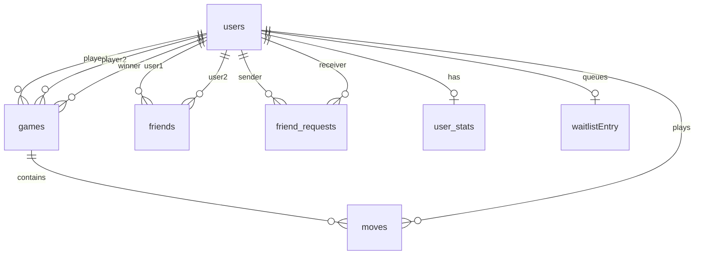

*This project has been created as part of the 42 curriculum by edobele, mzimeris, arboudau, bergun, nefadli.*

# ChessGuard

## Description
ChessGuard is a multiplayer chess platform built for the 42 Transcendence project. The goal is to offer a complete web-based game with real-time matches, social features, AI opponents, and a 3D mode, while keeping the architecture split into dedicated services.

Key features:
- Live chess matches with WebSocket synchronization.
- Local, remote, spectator, and AI game modes.
- Authentication, profiles, friends, matchmaking, and chat.
- A 3D board mode and a custom design system.
- A separate AI service for move prediction.

## Team Information
| Member | Main role | Responsibilities |
|---|---|---|
| mzimeris | Tech / infra lead | Docker, deployment flow, health services, backups, secrets, and overall service orchestration. |
| edobele | Frontend lead | React UI integration, layout, visual polish, and Vite-based frontend workflow. |
| arboudau | Game / realtime lead | Game flow, WebSocket synchronization, lobby logic, and remote gameplay. |
| bergun | Backend / data lead | Auth, user management, Prisma schemas, and database-backed services. |
| nefadli | Product / social features | Friends, matchmaking, chat, spectator-related features, and documentation support. |

## Project Management
The team organized the work by splitting the project into services and feature blocks: frontend, game engine, auth, matchmaking, social features, AI, and infrastructure. This allowed several parts to move in parallel while keeping API contracts stable.

Tools and workflow:
- Git for version control and branch-based work.
- GitHub repository history for tracking changes and reviewing integration points.
- Docker Compose and the Makefile to keep local environments reproducible.
- Shared documentation in the documents/ folder to keep implementation notes aligned.

Communication was handled through direct team exchanges and short syncs around API changes, merge points, and integration issues.

## Technical Stack
### Frontend
- React for the component-based SPA.
- Vite for fast development, hot reload, and production builds.
- react-three-fiber and drei for the 3D board mode.
- framer-motion for UI animations.
- i18next for localization.
- chess.js for chess rules and board state handling.

Why: React and Vite give a fast iteration loop and keep the UI organized by reusable components. The 3D stack was added only where it brought real value to the game experience.

### Backend
- Express for the Node.js microservices.
- ws for real-time game communication.
- JSON Web Tokens for authentication.
- bcrypt for password hashing.
- multer for avatar/file uploads.
- Prisma for type-safe database access and migrations.

Why: Express keeps each service lightweight and easy to split by responsibility, while WebSockets cover the realtime chess requirements.

### AI Service
- FastAPI for the Python prediction API.
- Uvicorn as the ASGI server.
- PyTorch for the neural network model.
- python-chess and Stockfish-related logic for chess analysis and move selection.

Why: FastAPI is simple to expose and fits a lightweight inference service well. Keeping AI outside the Node.js services makes the system easier to maintain.

See [src/ai/README.md](src/ai/README.md) for the dedicated documentation of this service: model architecture, data pipeline, API contract, and how to run or retrain it.

### Database and Infrastructure
- PostgreSQL as the main database.
- Prisma as ORM and migration tool.
- Nginx as reverse proxy and public entry point.
- Docker / Docker Compose for the full local stack.
- Secrets mounted from files for safer runtime configuration.

Why PostgreSQL: it fits the relational data model of chess users, matches, moves, and social features, and works cleanly with Prisma.

## Database Schema
The data model is centered on a few core entities:
- users: account data, profile fields, Elo, timestamps, and current game reference.
- games: players, status, winner, rating flag, and current FEN position.
- moves: full move history with from/to squares, special move flags, and timestamps.
- friends: symmetric friendship links.
- friend_requests: pending social requests.
- waitlistEntry: matchmaking queue entries.
- user_stats: aggregated player statistics.

Main relationships:
- A user can own multiple games as player 1, player 2, or winner.
- A game contains many moves.
- A user can have one stats row and one active waitlist entry.
- Friends and requests connect two users together.



## Instructions
### Prerequisites
- Docker and Docker Compose v2 or Podman
- Make.
- Git.
- Optional for direct service work: Node.js for the frontend and backend services, Python 3.11+ for the AI service.

### Setup
1. If you need the sample environment values, start from `.env.example` and adapt it to your local setup.
2. Generate the required secrets:
   ```bash
   ./scripts/secrets.sh
   ```
3. Start the stack in development:
   ```bash
   make up
   ```
4. If needed, seed the database after the containers are up:
   ```bash
   make db-seed
   ```
5. Open the application through the Nginx entry point exposed by Docker Compose.

### Useful commands
- `make up` to build and start the development stack.
- `make down` to stop the stack.
- `make restart SERVICE=<name>` to restart one service.
- `make logs SERVICE=<name>` to follow logs.
- `make db-seed` to populate the database.
- `make prod` to start the production stack.

### Notes
- Secrets are stored in `src/secrets/` and are required before launching the stack.
- If you modify Prisma schemas, regenerate the client before type checks.
- For development, the code is mounted into containers so frontend and backend changes are usually live-reloaded.

## Features List
| Feature | Main contributors | Description |
|---|---|---|
| Authentication and profile management | bergun, mzimeris | Register, login, JWT-based session handling, avatars, and profile data. |
| Real-time chess game engine | arboudau | Live board synchronization, move validation, turn handling, and game state updates. |
| Remote multiplayer | arboudau, nefadli | Real-time games between two remote players with disconnection handling in progress. |
| Matchmaking | nefadli, arboudau | Queue-based opponent search and game creation flow. |
| AI opponent | edobele | AI game mode with Stockfish-backed analysis and custom AI behavior. |
| 3D board mode | edobele | Immersive 3D rendering for the board and piece interactions. |
| Friends system | bergun, nefadli | Friend requests and social graph management. |
| Spectator mode | arboudau, nefadli | Observe active games without interacting with the board. |
| Design system and UI components | edobele | Reusable components, visuals, icons, and gameplay controls. |
| Health, backup, and status services | mzimeris | Service health checks, database health validation, and backup flow. |

## Modules
Point values: Major = 2 pts, Minor = 1 pt.

| Module | Type | Points | Implementation summary | Contributors |
|---|---|---:|---|---|
| Use a frontend framework | Minor | 1 | React SPA with Vite build tooling. | all |
| Use a backend framework | Minor | 1 | Express-based microservices for auth, game, friends, matchmaking, and status. | all |
| Real-time features using WebSockets | Major | 2 | Live move sync, disconnections, and message broadcasting over sockets. | arboudau |
| ORM for the database | Minor | 1 | Prisma schemas and client generation for typed persistence. | mzimeris |
| Custom-made design system | Minor | 1 | Reusable UI components, icons, board controls, and gameplay actions. | all |
| |
| Support for multiple langages | Minor | 1 | French, English and Turkish. | bergun, nefadli |
| |
| Standard User management and auth. | Major | 2 | Profiles, avatars, auth, and account lifecycle. | edobele, mzimeris |
| |
| AI opponent | Major | 2 | FastAPI service exposing prediction endpoints for computer play. | edobele |
| |
| Complete web-based game | Major | 2 | Full chess gameplay with clear win/loss/draw conditions and live matches. | all |
| Remote players | Major | 2 | Two players can play the same game from separate clients in real time. | arboudau, nefadli |
| Advanced 3D graphics | Major | 2 | 3D board mode built with Three.js via react-three-fiber/drei. | edobele |
| Spectator mode | Minor | 1 | Allow users to watch friends games | arboudau |
| |
| Backend as microservices | Major | 2 | Split into auth, friends, game, matchmaking, and status services. | all |
| Healthcheck & status page | Minor | 1 | with automated backups and disaster recovery procedures. | arboudau |
| Monitoring system | Major | Major | 2 | Prometheus and Grafana. | arboudau |
| |
| CyberSecurity | Major | 2 | WAF/ModSecurity (hardened) + HashiCorp Vault | bergun |
||
| Custom module: homemade AI | Major | 2 | Project-specific AI logic beyond the standard framework choice. | edobele |


Total: 27 points.

### Custom module justification: homemade AI

The custom module is a from-scratch neural network chess engine (**ChessNet**), served by the dedicated `ai` microservice. Full technical documentation lives in [src/ai/README.md](src/ai/README.md); the justification below summarizes why it counts as a valid extra module.

- **Fully functional**: `ChessNet` (PyTorch, policy + value heads) is trained end to end on real Lichess games and exposed via a FastAPI service (`/predict`, `/health`) wired into `docker-compose.yml`/`docker-compose.prod.yml` and reachable through nginx at `/ai/predict`. The frontend's AI game mode calls it directly.
- **Meets the module requirements**: it is a complete, self-contained addition to the project's architecture — its own data pipeline (PGN filtering/parsing, tensor encoding, chunked preprocessing), its own training loop, and its own inference service — not a thin wrapper around an existing framework feature.
- **Real value added**: unlike the standard AI opponent (Stockfish, used for the Training mode), this engine's playing style is directly shaped by real human games rather than a hand-crafted evaluation function. It is deployed as an independent, isolated/scalable microservice, and demonstrates an end-to-end ML workflow (data collection → training → production inference) integrated into the broader microservices architecture.
- **Technical challenges addressed**: large-scale PGN parsing/cleaning, FEN → tensor board encoding, designing and training a combined policy/value network, and integrating its predictions into a minimax search with alpha-beta pruning to keep inference fast enough to be playable in real time.

## Individual Contributions
### mzimeris
- Set up and maintained the Docker / Compose / secrets workflow.
- Worked on health, backup, and infrastructure-oriented services.
- Helped define the service boundaries for the microservice architecture.
- Main challenge: keeping several containers and secrets synchronized; solved by using file-based secrets and a consistent Makefile workflow.

### edobele
- Built and polished the frontend application shell and reusable UI pieces.
- Contributed to the 3D mode integration and visual consistency.
- Helped shape the design system and gameplay controls.
- Main challenge: keeping the interface readable across multiple game modes; solved through reusable components and animation discipline.

### arboudau
- Implemented the realtime game flow, socket synchronization, and remote match behavior.
- Contributed to matchmaking, spectator behavior, and core chess interactions.
- Main challenge: keeping board state, socket events, and UI state aligned; solved by centralizing game logic and event handling.

### bergun
- Worked on authentication, user management, Prisma schemas, and data persistence.
- Contributed to the social and profile-oriented backend features.
- Main challenge: keeping auth, database, and microservice boundaries type-safe; solved by using Prisma and strict service contracts.

### nefadli
- Contributed to matchmaking, social features, and documentation support.
- Helped connect player-facing flows across the game and social layers.
- Main challenge: coordinating several user journeys without making the app feel fragmented; solved by keeping the feature set consistent around the lobby and player profile flows.

## Resources
### Classic references
- React documentation: https://react.dev/
- Vite documentation: https://vite.dev/
- Express documentation: https://expressjs.com/
- Prisma documentation: https://www.prisma.io/docs
- FastAPI documentation: https://fastapi.tiangolo.com/
- Uvicorn documentation: https://www.uvicorn.org/
- WebSockets on MDN: https://developer.mozilla.org/en-US/docs/Web/API/WebSockets_API
- Three.js documentation: https://threejs.org/docs/
- react-three-fiber: https://docs.pmnd.rs/react-three-fiber
- chess.js: https://github.com/jhlywa/chess.js
- python-chess: https://python-chess.readthedocs.io/
- Stockfish: https://stockfishchess.org/

### AI usage
AI was used to help draft and structure this README, summarize the technical stack, and tighten the wording of the documentation sections. It was not used to generate the core gameplay, database schema, or service logic.
